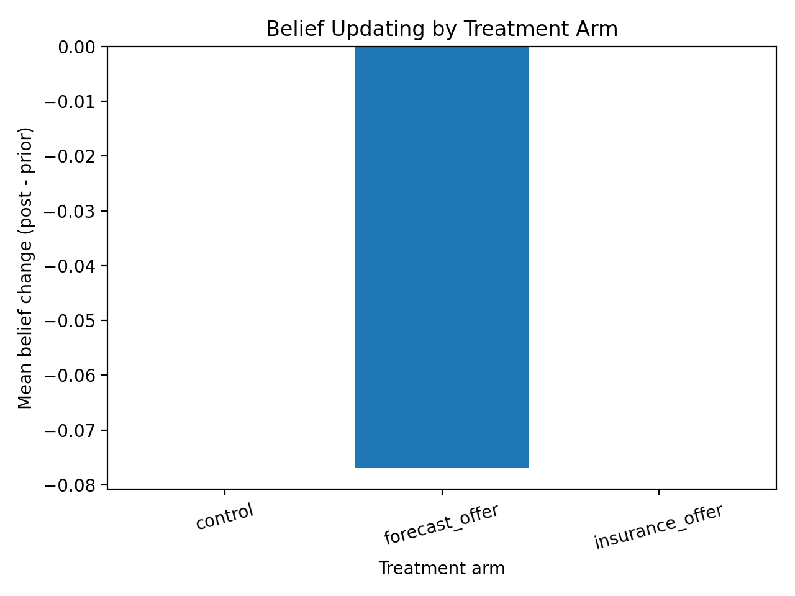
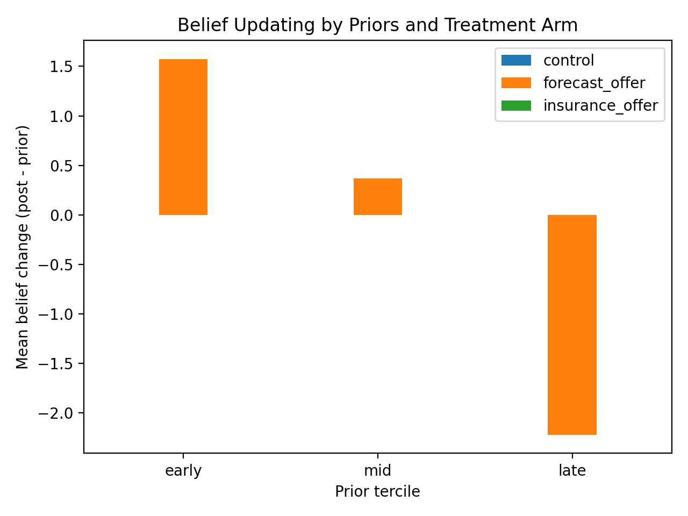
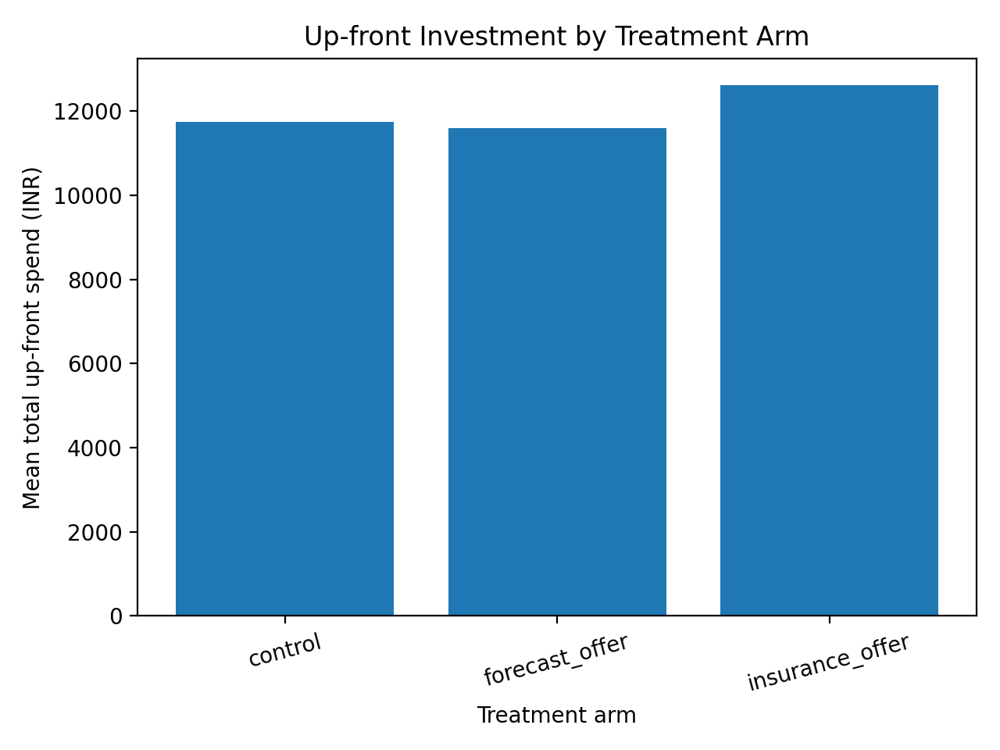
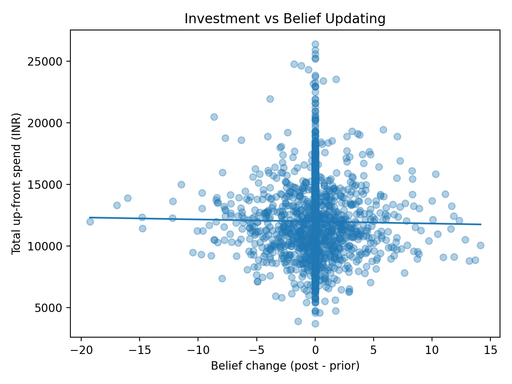
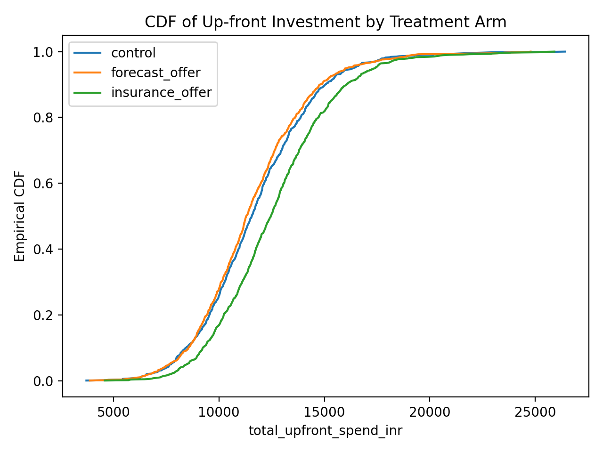
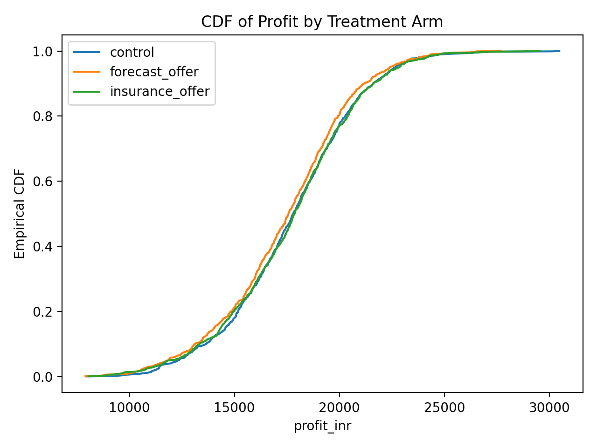
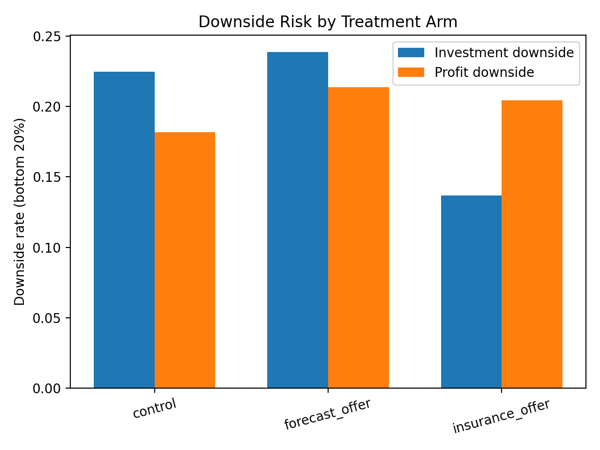
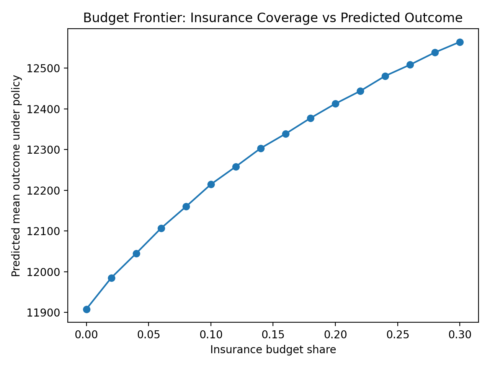

# RESULTS.md — Forecasts vs Insurance: Mechanism + Risk + Budget Targeting

This document summarizes the outputs produced by running:

```bash
python src/prep_data.py
python src/mechanism_scorecard.py
python src/risk_evaluation.py
python src/policy_targeting.py
```

> **Note:** The data used in this repo is **synthetic**. The contribution is the **reproducible workflow + policy-learning framework**; numerical values are illustrative.

---

## Big question

**How should a policymaker allocate a low-cost forecast product and a higher-cost insurance subsidy—using only pre-season information—to maximize up-front investment and reduce downside risk, and through what belief-updating mechanism does the forecast work?**

---

## Key results at a glance

### Mechanism (belief updating → investment)
- Forecast offer does **not** shift beliefs on average in this synthetic run (Δbelief ≈ **−0.08 days**, p=0.80).
- Belief change is **not strongly related** to investment (≈ **−18.7 INR/day**, p=0.28).
- Insurance offer increases up-front investment by **~+882 INR** (p≈2.38e−12).

### Downside risk (bottom 20%)
- **Investment downside rate**: Insurance reduces downside risk from **22.49% (control)** to **13.69%** (**−8.80 pp**).
- Forecast does **not** reduce downside investment risk (**23.90%**).
- Profit downside risk does not improve in this synthetic draw (profits are noisier here).

### Policy translation (budget targeting)
Model-predicted mean up-front investment:
- All Control: **11,639.6**
- All Forecast: **11,624.4**
- All Insurance: **12,578.7**
- **Unconstrained targeting:** **12,845.2** (best)
- **Budget targeting (15% insurance cap):** **12,322.2**

Assignments on the held-out test sample (900 households):
- Unconstrained: **65.3% insurance / 16.2% forecast / 18.4% nothing**
- Budget 15%: **15.0% insurance / 36.9% forecast / 48.1% nothing**

---

## Where to find the tables

All tables are saved under `outputs/tables/`.

### Mechanism
- `mechanism_by_arm.csv`
- `mechanism_by_prior_tercile.csv`
- `mechanism_scorecard_summary.csv`

### Risk
- `risk_downside_by_arm.csv`
- `risk_quantiles_by_arm.csv`

### Policy
- `policy_summary.csv`
- `policy_assignment_counts.csv`
- `policy_assignments_test.csv`

---

## Figures with explanations

All figures are saved under `outputs/figures/`.

### 1) Belief updating by treatment arm  
**File:** `outputs/figures/fig_belief_change_by_arm.png`



**How to read it:**  
- The y-axis is the average **belief change**: `post_onset_mean_doy − prior_onset_mean_doy`.  
- Bars near 0 mean beliefs did not move much.

**What it shows here:**  
- In this run, average belief change is ~0 (forecast is slightly negative), consistent with the scorecard.

---

### 2) Belief updating by priors (early/mid/late) and arm  
**File:** `outputs/figures/fig_belief_change_by_tercile_and_arm.png`



**How to read it:**  
- People are grouped into terciles based on their **prior** monsoon-onset belief: early / mid / late.  
- This reveals **heterogeneity** that averages can hide.

**What it shows here:**  
- Belief changes in the forecast arm vary by prior tercile (early vs late priors move in opposite directions), even though the overall average is small.

---

### 3) Up-front investment by arm  
**File:** `outputs/figures/fig_investment_by_arm.png`



**How to read it:**  
- Higher bars mean households spent more on up-front inputs (seed/fertilizer/labor/etc.).  
- This is the main “behavioral” outcome for the MVP.

**What it shows here:**  
- Insurance has the highest investment; forecast is slightly below control—matching the tables.

---

### 4) Investment vs belief updating (scatter)  
**File:** `outputs/figures/fig_investment_vs_belief_change.png`



**How to read it:**  
- Each dot is a household.  
- X-axis: belief change; Y-axis: up-front investment.

**What it shows here:**  
- Many observations pile up around belief change ≈ 0, so the relationship looks weak in this run—consistent with the scorecard.

---

### 5) CDF of up-front investment by arm  
**File:** `outputs/figures/fig_cdf_investment_by_arm.png`



**How to read it:**  
- A CDF curve shows “what fraction of households are at or below a given investment level.”  
- A curve that is **lower** in the left tail indicates **fewer very low outcomes**.

**What it shows here:**  
- Insurance shifts the investment distribution away from the low tail, aligning with the downside-risk results.

---

### 6) CDF of profit by arm  
**File:** `outputs/figures/fig_cdf_profit_by_arm.png`



**How to read it:**  
- Same idea as investment CDF, but for profits.

**What it shows here:**  
- Profit curves overlap more strongly than investment curves, indicating profit is a noisier endpoint in this synthetic draw.

---

### 7) Downside risk by arm (bottom 20%)  
**File:** `outputs/figures/fig_downside_rates_by_arm.png`



**How to read it:**  
- Bars show the fraction of households in the bottom 20% (“bad outcomes”).  
- Lower is better.

**What it shows here:**  
- Insurance reduces downside investment risk substantially; forecast does not.

---

### 8) Budget frontier (insurance coverage vs predicted outcomes)  
**File:** `outputs/figures/fig_budget_frontier.png`



**How to read it:**  
- X-axis: how many households can receive insurance (budget share).  
- Y-axis: predicted mean investment under the policy.  
- Helps policy makers see “bang for buck” as budgets increase.

**What it shows here:**  
- Predicted outcomes increase as insurance coverage increases, often with diminishing returns.

---

## How this answers the research questions

### Q1 — Targeting policy under budget
**Question:** Who should get forecast vs insurance vs nothing under limited budget (using only baseline info)?  
**Answer in this run:** A budget-constrained policy concentrates insurance on the highest predicted-benefit households (15%), allocates forecasts to a middle group (~37%), and assigns nothing when predicted net benefit is low (~48%).

### Q2 — Mechanism scorecard
**Question:** Does forecast change beliefs, and do belief changes explain investment?  
**Answer in this run:** Average belief updating is small and not strongly linked to investment; insurance drives investment changes more directly.

### Q3 — Risk-focused evaluation
**Question:** Do interventions reduce the chance of bad outcomes (bottom tail)?  
**Answer in this run:** Insurance substantially reduces downside **investment** risk; downside **profit** effects are weak/unclear here.

---

## Next steps (if mapping to real RCT data)
1) Replace synthetic file with real baseline + endline, map columns to the same names.
2) Add research-grade policy evaluation (doubly robust off-policy estimators) + clustered uncertainty.
3) Add sensitivity analysis on costs and downside thresholds.
